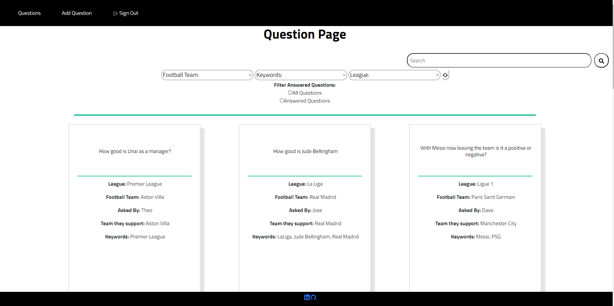

# SpringBootProject
Repo to try new things within Spring Boot Java 

#Front end issues   
From messing with code and the actual page it self some errors I have found is the simple search doesn't seem to work on the front-end but when tested with postman the back end search is fine.
Another is inputting data for example when trying to edit a question does not seem to work either.
#Will update if I come back to this project and find any more or fix any.

 
Here is a picture of the login screen where the admin can login only with specified details given within the import.sql

 

Here is a picture of the main screen of the website where the user can see all the questions currently within the database and can filter using the
filter options across the top of the screen.

